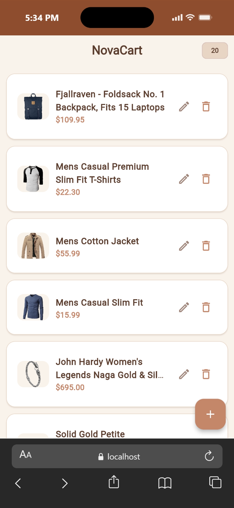
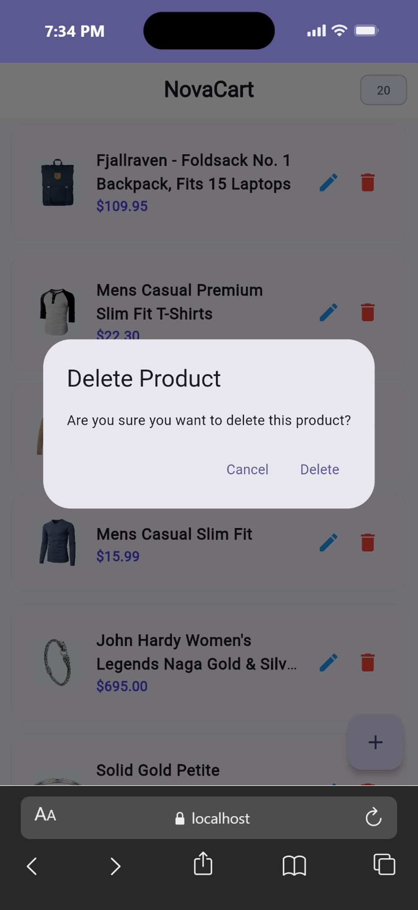
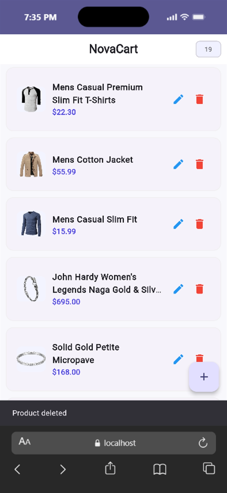
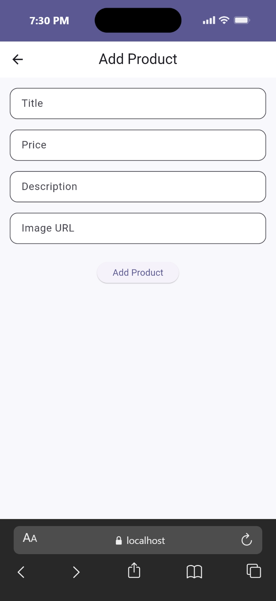
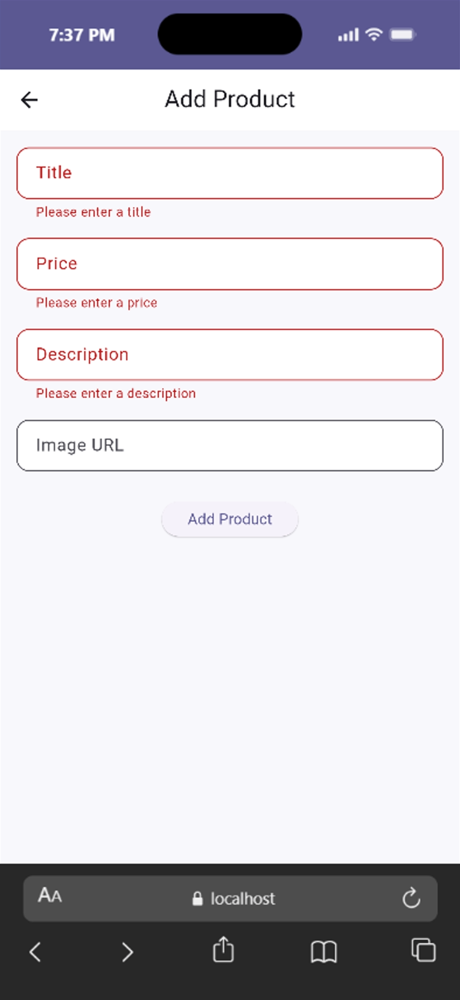
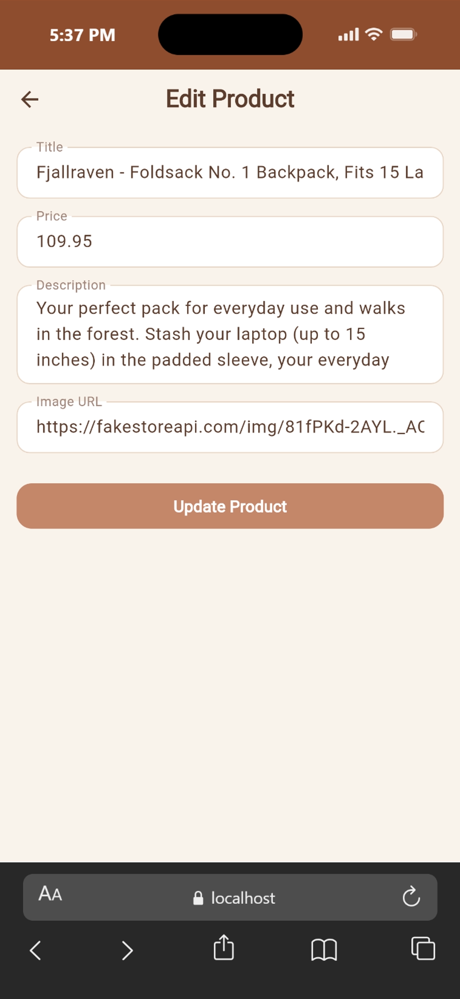

# NovaCart


A modern Flutter CRUD application powered by Provider and [Fake Store API](https://fakestoreapi.com/) (public REST API).

---

## Project Overview
NovaCart is a simple but polished e-commerce style application where users can:

- View products from a remote API
- Add new products
- Edit existing products
- Delete products with confirmation
- Experience real-time UI updates using Provider

The project focuses on API integration, state management, and clean UI/UX design.

---

## Features

- **Read** — Fetches and displays all products from the Fake Store API
- **Create** — Add new products with form validation
- **Update** — Edit existing products with pre-filled fields
- **Delete** — Remove products with a confirmation dialog
- Loading states on all async operations
- Error state with retry button on the home screen
- Empty state with helpful message
- Image error fallback for broken URLs
- Item count badge in the app bar

---

## Screenshots

| Home | Delete Confirmation | After Delete |
|------|-------------------|--------------|
|  |  |  |

| Add Product (empty) | Add Product (validation) | Edit Product |
|--------------------|--------------------------|--------------|
|  |  |  |

---

## Project Structure

```
lib/
├── main.dart                      # App entry point, Provider setup, theme
├── models/
│   └── product_model.dart         # Product data class (fromJson, copyWith)
├── services/
│   └── api_service.dart           # HTTP layer — all API calls
├── providers/
│   └── product_provider.dart      # ChangeNotifier — state + CRUD logic
└── screens/
    ├── home_screen.dart           # Product list with edit/delete actions
    ├── add_product_screen.dart    # Create product form
    └── edit_product_screen.dart   # Edit product form
```

---

## Architecture

```
UI Screens
    │  Consumer<ProductProvider> / Provider.of
    ▼
ProductProvider (ChangeNotifier)
    │  _products, isLoading, error
    │  fetchProducts / addProduct / updateProduct / deleteProduct
    ▼
ApiService (http package)
    │
    ▼
https://fakestoreapi.com/products
```

---

## API Reference
This project uses the Fake Store API:

##### Base URL:

https://fakestoreapi.com/products

---

## API Endpoints Used

| Method | Endpoint | Description |
|--------|----------|-------------|
| GET | `/products` | Fetch all products |
| POST | `/products` | Create a new product |
| PUT | `/products/:id` | Update an existing product |
| DELETE | `/products/:id` | Delete a product |

---

## Getting Started

### Prerequisites

- Flutter SDK ≥ 3.0
- Dart ≥ 3.0

### Run

```bash
git clone https://github.com/YordanosBisrat/NovaCart.git
cd NovaCart
flutter pub get
flutter run
```

To run on a specific platform:

```bash
flutter run -d chrome       # Web
flutter run -d windows      # Windows desktop
flutter run                 # Connected mobile device
```
---

## Tech Stack

- Flutter
- Dart
- Provider
- HTTP
- Fake Store API
- Material 3


## Dependencies

```yaml
provider: ^6.1.5+1   # State management
http: ^1.6.0         # Network requests
```


## Author
Developed as part of a Mobile Application Development assignment, focused on clean architecture and real-world Flutter practices.

## Student Information

- **Name:** Yordanos Bisrat
- **ID:** UGR/3362/16
- **Section:** 1